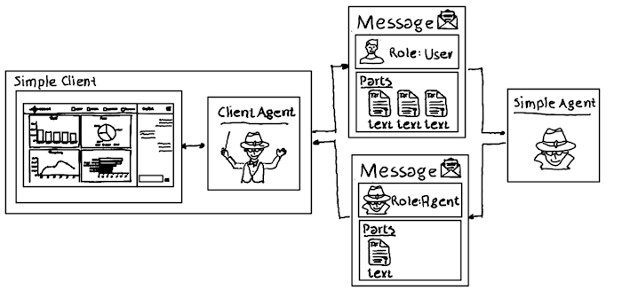

# Agent2Agent Protocol (A2A) with .NET

## Overview

The Agent-to-Agent (A2A) protocol enables AI agents, built on diverse frameworks, different software stacks, and running on separate servers, to communicate and collaborate with each other. It promotes open standards like:

- SSE (Server Sent Events)
- HTTP(s)
- JSON-RPC
- ...

Beside it's technology stack agnostic behavior A2A allows agents to:
 
- be discovered
- share capabilities
- negotiate interaction modalities (text, forms, media).
- collaborate on long running tasks
- operate without exposing agent interna
- ...

### Agent Card / Agent Discovery

A2A Agents provicde a JSON document that describes the Agent's capabilities, skills, service endpoint and how client agents should ineract with it. 

The recommended location for an Agent Card is: `https://{server_domain}/.well-known/agent.json`

The A2A protocol does not dictate how agent cards can be discovered. Options are: 

- Well known URI based on the agent's domain. E.g.: `https://mysalesagent.mydomain.com`/.well-known/agent.json
- Curated registries or catalogs (public or private)
- Direct configuration where client agents are provisioned with card content itself. 
- ...

### Application Integration

A component called `Client Agent` as part of an application is using the A2A protocol to communicate with `Remote Agent(s)`.

## Repo Content

The repo contains two simplified client agent/remote agent implementations:

- [Simple Agent Sample](./src/SimpleAgentSample/) demonstrates a remote agent which responds immediately with a response to a client agent request. This can be used if the client agent request isn't taking to long. The remote agent provides an Agent Card to make its capabilities visible. 
- [Task Agent Sample](./src/TaskAgentSample/) demonstrates a remote server which will take more time to fulfill the client agent request. Therefore it returns a Task object, provides progress updates and the final request response. Streaming is used by the [client application](./src/TaskAgentSample/TaskClient/) to show updates from the [remote agent](./src/TaskAgentSample/TaskAgent/). 

